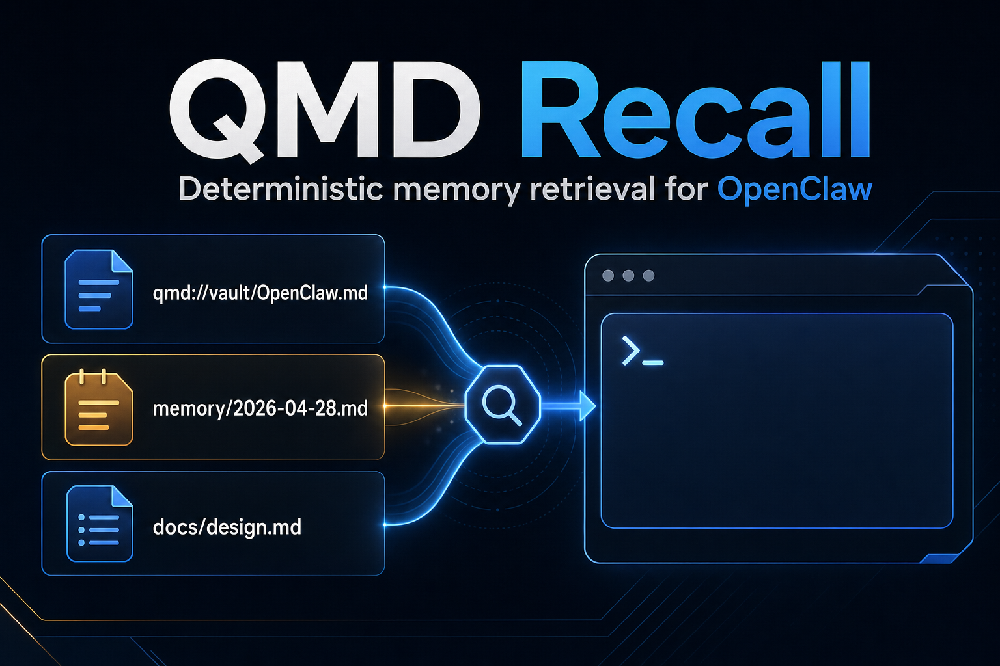

# QMD Recall



Deterministic memory recall for OpenClaw.

QMD Recall replaces the brittle parts of `active-memory` with a boring retrieval layer: run QMD, collect a few cited snippets, inject them before the model sees the prompt, and get out of the way.

No embedded LLM subagent. No 20 second pre-answer séance. No mystery vector swamp.

## Why this exists

OpenClaw's `active-memory` plugin had the right product idea:

- before a reply, search long-term memory
- inject relevant context invisibly
- let the assistant answer with continuity

The problem is the implementation path. `active-memory` launches an embedded agent with memory tools before the real assistant turn. In practice that path can hang, time out, and add painful latency while producing `summaryChars=0`.

QMD Recall treats memory as retrieval, not reasoning. QMD already ranks the wiki/vault/session corpus. The hot path should be deterministic, bounded, and fail-closed.

## What it does

On eligible turns, QMD Recall:

1. checks a deterministic trigger classifier
2. calls the QMD HTTP API with a hard timeout
3. filters by score and top-k
4. injects a compact hidden context block with citations
5. logs status without logging private snippets by default

If anything fails, it injects nothing.

## Example injected context

```text
Relevant memory from QMD:
- [memory/2026-04-28.md#L4-L8] Cron regression root cause was deAIify rewriting cron prompts...
- [10-Projects/Launch.md#L1-L5] Launch project owns the current go-to-market plan...
Use only if relevant. Do not mention memory search unless asked.
```

## Install

### From source

```bash
git clone https://github.com/shawnpetros/qmd-recall.git ~/projects/qmd-recall
cd ~/projects/qmd-recall
npm install
npm run build
```

Then add the plugin to your OpenClaw config. Do not paste this blindly into production without checking your paths:

```json
{
  "plugins": {
    "entries": {
      "qmd-recall": {
        "enabled": false,
        "path": "/Users/YOU/projects/qmd-recall/dist/index.js",
        "config": {
          "agents": ["main"],
          "allowedChatTypes": ["direct"],
          "timeoutMs": 1500,
          "maxResults": 3,
          "minScore": 0.5,
          "maxSnippetChars": 420,
          "maxInjectedChars": 1600,
          "collections": ["vault"],
          "qmdUrl": "http://localhost:8181/query",
          "logSnippets": false
        }
      }
    }
  }
}
```

Restart OpenClaw after enabling:

```bash
openclaw gateway restart
```

## One-prompt install for an OpenClaw agent

Paste this into an OpenClaw coding-capable session:

```text
Install QMD Recall for OpenClaw from https://github.com/shawnpetros/qmd-recall.
Clone it to ~/projects/qmd-recall, run npm install and npm run build, then propose an openclaw.json plugin entry but do not overwrite my live config without confirmation. Configure it direct-message only, timeoutMs 1500, maxResults 3, minScore 0.5, searchMode search, logSnippets false. Restart the gateway only after I approve the config patch.
```

## Configuration

| Key | Default | Meaning |
| --- | --- | --- |
| `agents` | `["main"]` | Agent IDs allowed to run recall. |
| `allowedChatTypes` | `["direct"]` | Chat types allowed. Keep shared/group off unless you know what you are doing. |
| `timeoutMs` | `1500` | Hard QMD timeout. Timeout means inject nothing. |
| `maxResults` | `3` | Maximum QMD hits requested and injected. |
| `minScore` | `0.5` | Drop lower-confidence hits when QMD returns scores. |
| `maxSnippetChars` | `420` | Per-hit snippet cap. |
| `maxInjectedChars` | `1600` | Whole injected block cap. |
| `queryMode` | `message` | `message` or `message-and-recent`. |
| `searchMode` | `search` | QMD command to run: `search`, `query`, or `vsearch`. `search` is the fast default. |
| `collections` | `["vault"]` | QMD collections to search. Run `qmd collection list` to see yours. |
| `qmdUrl` | `http://localhost:8181/query` | QMD HTTP query endpoint. Start it with `qmd mcp --http`. |
| `logSnippets` | `false` | Reserved for debug builds. Keep false in real use. |
| `triggers.include` | see config | Terms that force recall. |
| `triggers.exclude` | see config | Exact short messages that skip recall. |

## Safety model

QMD Recall is conservative by default:

- direct-message only
- private snippets are not logged
- shared/group channels are disabled unless explicitly configured
- hard timeout prevents hidden pre-answer lag
- retrieval failures do not block the assistant
- citations stay inside hidden context unless the assistant chooses to cite them

For client Slack or public Discord, keep this off unless you have a separate safe corpus.

## Trigger model

This is intentionally dumb. Dumb is fast and predictable.

Recall runs when:

- message contains configured trigger terms
- message mentions dates or relative time words
- message is a who/what/when/where/why/how question

Recall skips when:

- exact short acknowledgements like `send it`, `yes`, `no`, `lol`
- message is below `triggers.minChars` and has no include match

## Development

```bash
npm install
npm run build
npm test
```

The pure retrieval logic lives in `src/core.ts`. The QMD process adapter lives in `src/qmd.ts`. The OpenClaw hook entry lives in `src/index.ts`.

## Current assumptions

This plugin targets OpenClaw's `before_prompt_build` hook and returns `{ prependContext }`, matching the observed active-memory plugin behavior in OpenClaw 2026.4.24.

QMD Recall expects the QMD HTTP endpoint:

```bash
qmd mcp --http
curl -X POST http://localhost:8181/query -H "Content-Type: application/json" -d '{"searches":[{"type":"lex","query":"test memory"}],"collections":["vault"],"limit":3}'
```

If your QMD install uses a different host or port, set `qmdUrl`.

## Troubleshooting

### No recall is injected

- Confirm the plugin is enabled in `openclaw.json`.
- Confirm the chat type is allowed.
- Send a message with a trigger term like `remember`.
- Check gateway logs for `qmd-recall:`.

### QMD errors

Run this manually:

```bash
curl -X POST http://localhost:8181/query -H "Content-Type: application/json" -d '{"searches":[{"type":"lex","query":"test memory"}],"collections":["vault"],"limit":3}'
```

If that fails, start QMD with `qmd mcp --http` or update `qmdUrl` to the correct endpoint.

### It feels slow

Lower `timeoutMs`. Recommended range is 800 to 1500ms. This plugin should never block a turn for multiple seconds.

## Roadmap

- provider API adapter for QMD implementations that expose HTTP/IPC
- per-channel corpus policies
- install command for ClawHub
- debug command: `/qmd-recall status`
- optional safe public corpus for shared channels

## License

MIT

## Security note: QMD endpoint boundary

QMD Recall does not execute shell commands. It calls a configured QMD HTTP endpoint and applies a hard timeout.

Risk controls:

- `qmdUrl` is explicit and configurable.
- Failures inject nothing.
- Snippets are not logged by default.
- Shared channels are disabled by default.
- The QMD daemon stays under the user's control.
